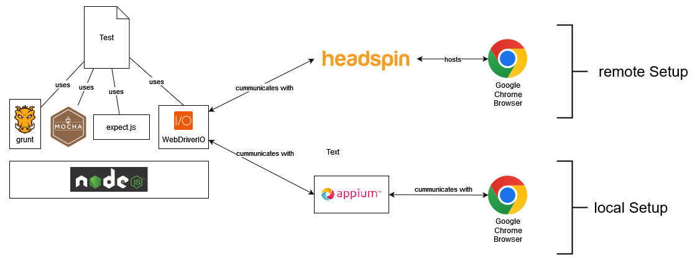

# TMCSP-webshop-test-automation

This project contains automated tests for a demo webpage hosted by Tricentis.

## prerequisites

This project requires [Node.js](https://nodejs.org).

## installation

To get the project up and running all you need is an Ubuntu (tested with 22.04.1) machine (2 CPU cores are enough) and the following commands.

* execute `git clone https://github.com/tederer/TMCSP-webshop-test-automation.git`
* execute `npm install`

The following steps are necessary if you want to execute the tests on a local Chrome browser instance.

* update google chrome to latest version
* execute `sudo npm i -g appium@next`
* execute `sudo npm i -g @appium/types`
* execute `appium driver install chromium`

## running the tests locally

The following steps are necessary to execute the tests on a local Chrome Browser instance.

* start your [Appium](http://appium.io) server by executing `appium` in a separate terminal
* navigate to the project folder
* execute `npm start`

## running the tests on a browser hosted by somebody else

The following steps are necessary to execute the tests on a Chrome Browser instance hosted somewhere on the internet (e.g. [headspin](https://www.headspin.io/)).

* navigate to the project folder
* put the URL of the web driver into the environment variable WEBDRIVERURL
* put the stringified capabilities object (JSON) of the web driver into the environment variable WEBDRIVERCAPABILITIES
* execute `npm start`

## references

[http://appium.io/docs/en/2.0/quickstart/install/](http://appium.io/docs/en/2.0/quickstart/install/)
[http://appium.io/docs/en/2.0/quickstart/uiauto2-driver/](http://appium.io/docs/en/2.0/quickstart/uiauto2-driver/)
[http://appium.io/docs/en/2.0/quickstart/test-js/](http://appium.io/docs/en/2.0/quickstart/test-js/)
[https://developer.mozilla.org/en-US/docs/Web/CSS/CSS_Selectors](https://developer.mozilla.org/en-US/docs/Web/CSS/CSS_Selectors)
[https://webdriver.io/docs/api](https://webdriver.io/docs/api)
[https://webdriver.io/docs/api/expect-webdriverio](https://webdriver.io/docs/api/expect-webdriverio)
[https://mochajs.org/](https://mochajs.org/)
[https://github.com/Automattic/expect.js](https://github.com/Automattic/expect.js)
[https://docs.github.com/en/actions/security-guides/encrypted-secrets](https://docs.github.com/en/actions/security-guides/encrypted-secrets)
